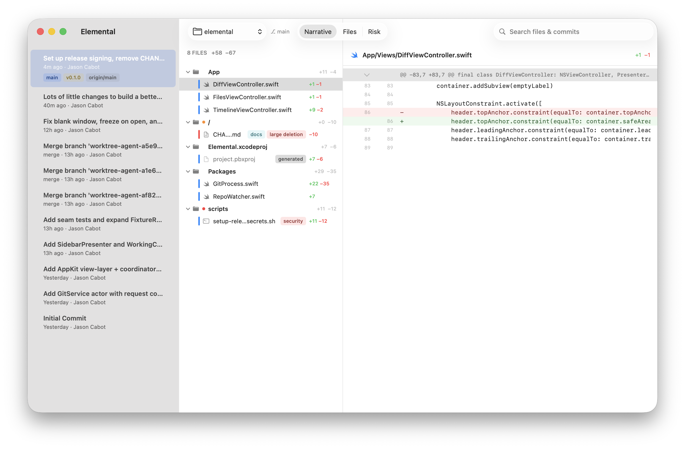
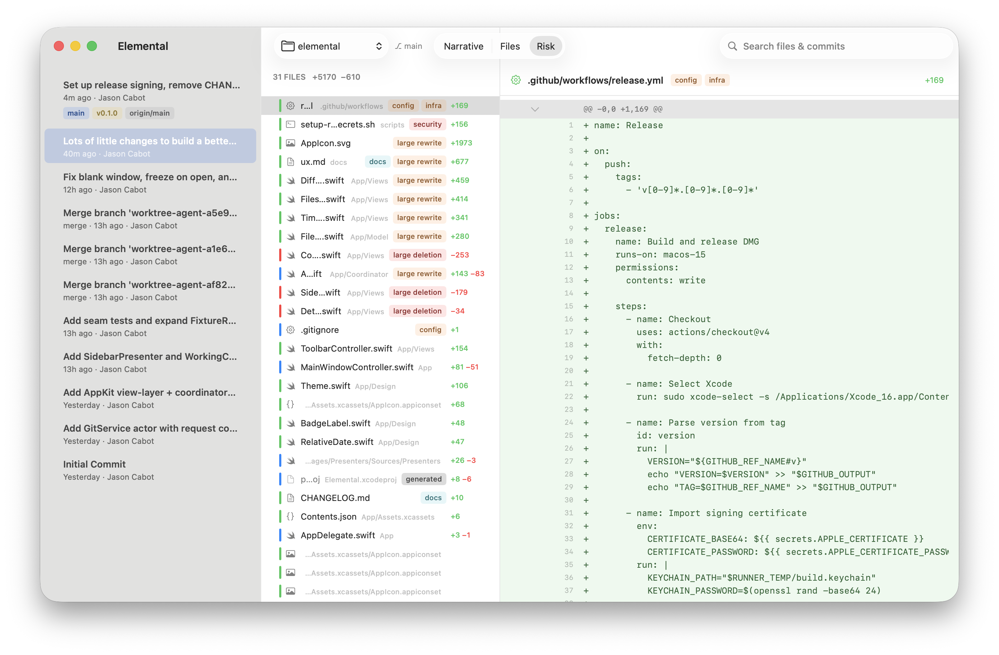

# Elemental

AI is writing more code than ever. Humans are still responsible for reviewing it. Elemental is built for that.

Browse commits, see which files changed and how significant each change is, read the diff.

Risk mode surfaces config, security, and infrastructure changes automatically — no AI required.

## Download

[**Elemental v0.1.0**](https://github.com/jasoncabot/elemental/releases/tag/v0.1.0) — requires macOS 15+

## What it is

- Native macOS app. Three panes: timeline → files → diff.
- Risk mode classifies changes by type (config, security, infra, generated) using heuristics.
- Read-only. It won't touch your repo.
